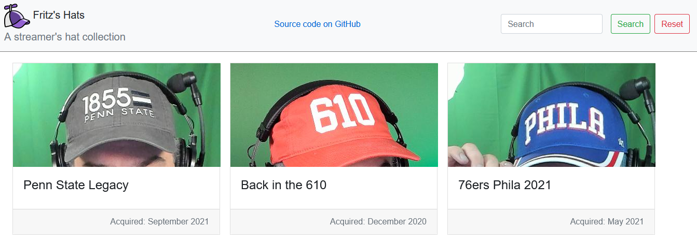

# [Fritz's Hat Collection](https://hats.csharpfritz.com)

[](https://github.com/csharpfritz/Fritz.HatCollection/actions/workflows/azure-static-web-apps-salmon-pond-0177b6f0f.yml)

This repository contains an example [Blazor WebAssembly](https://docs.microsoft.com/aspnet/core/blazor/?view=aspnetcore-3.1#blazor-webassembly) client application, a C# [Azure Functions](https://docs.microsoft.com/azure/azure-functions/functions-overview) and a C# class library with shared code.  Fritz wrote these to demonstrate a [simple Blazor site showing off his collection of hats](https://hats.csharpfritz.com).

[](https://hats.csharpfritz.com)

## Re-using this project

Fork this repository from the and then clone it locally to your machine.  This project is based on .NET Core 3.1 for the Azure functions and .NET 6 for the Blazor web-assembly application.
Create a repository from the [GitHub template](https://github.com/staticwebdev/blazor-starter/generate) and then clone it locally to your machine.

Once you clone the project, open the solution in [Visual Studio](https://visualstudio.microsoft.com/vs/community/) and press **F5** to launch both the client application and the Functions API app.

### Data storage

This project uses [Azure Storage](https://docs.microsoft.com/azure/storage/common/storage-introduction) to store data about the hats in a table named `Hats` and the images of those hats are stored in a blob container called `hat-images`.  You will need to configure this Azure Storage service for yourself and place the connection string for the storage service in a `Api/local.settings.json` file with the key name `AzureTableConnectionString`.  It should look something like this:

```json
{
	"IsEncrypted": false,
	"Values": {
		"AzureTableConnectionString": "YOUR CONNECTION STRING"
	}
}
```

Additionally, you will need to set the base url for your images in the `Program.cs/BaseImageUrl` variable.  This allows the `HatUi.razor` component to assemble a proper URL for the items in your collection.

_Note: If you're using the Azure Functions CLI tools, refer to [the documentation](https://docs.microsoft.com/azure/azure-functions/functions-run-local?tabs=windows%2Ccsharp%2Cbash) on how to enable CORS._

## Repository Structure

* **Client**: The Blazor WebAssembly application that displays the hat collection
* **API**: A C# Azure Functions API, which the Blazor application will call to fetch the hats to display
* **Shared**: A C# class library with a shared data model between the Blazor and Functions application
* **docs** content to support this readme and other educational materials

## Deploy to Azure Static Web Apps

This application can be deployed to [Azure Static Web Apps](https://docs.microsoft.com/azure/static-web-apps), to learn how, check out [our quickstart guide](https://aka.ms/blazor-swa/quickstart).

You can check out the various times this application has been deployed by reviewing the [Actions](actions) tab at the top of the repository.  The GitHub action definition that definies this deployment process is available in the [.github/workflows](/csharpfritz/Fritz.HatCollection/tree/main/.github/workflows) folder
